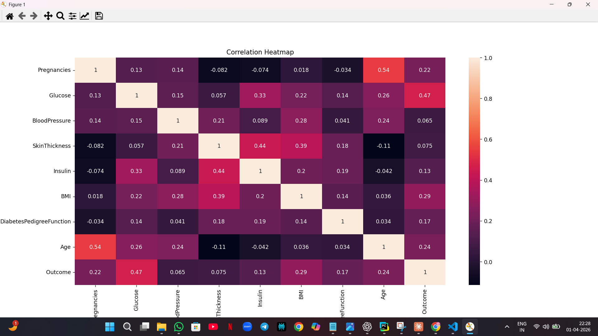
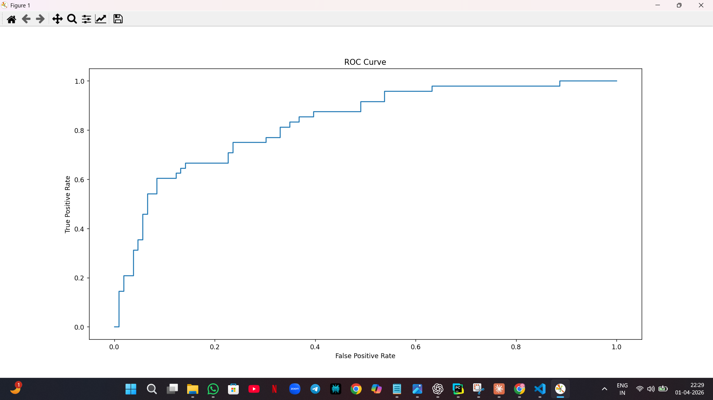
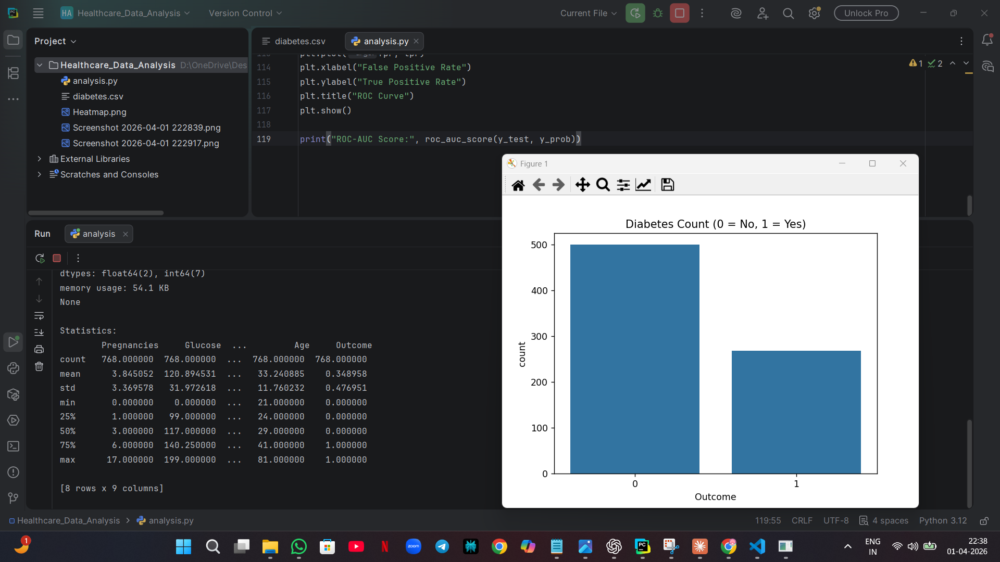

# Diabetes-Prediction
This project predicts diabetes using machine learning techniques. It includes data preprocessing, exploratory data analysis (EDA), visualization, and classification models to identify patterns in medical data.
# Diabetes Prediction using Machine Learning

This project predicts whether a patient has diabetes based on medical attributes.

## 📌 Features
- Data preprocessing and cleaning
- Exploratory Data Analysis (EDA)
- Correlation heatmap visualization
- Classification model (Logistic Regression)
- Model evaluation (Accuracy, Confusion Matrix)
- ROC Curve and AUC score

## 📊 Results
- Accuracy: ~80%
- ROC-AUC Score: Good predictive performance

## 📷 Visualizations
- Diabetes distribution
- Correlation heatmap
- ROC Curve

## 🛠 Technologies Used
- Python
- Pandas, NumPy
- Matplotlib, Seaborn
- Scikit-learn

## Visualizations

### Correlation Heatmap

### ROC Curve

### Outcome Distribution

## 🚀 Conclusion
The model shows good ability to distinguish between diabetic and non-diabetic patients based on medical data.
